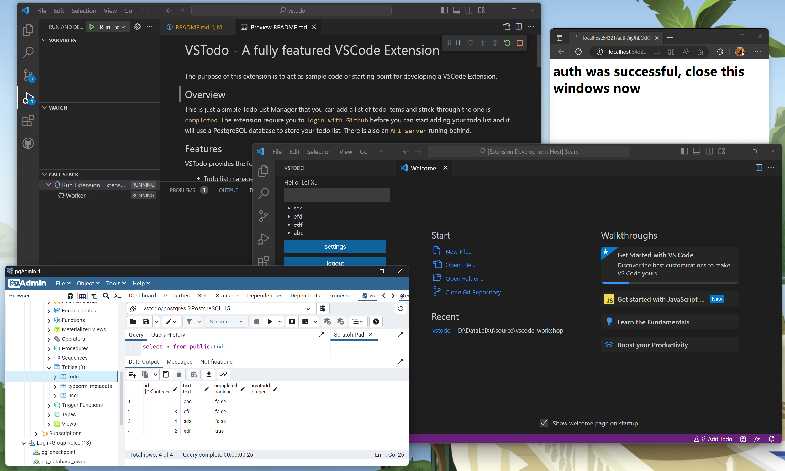

# VSTodo - A fully featured VSCode Extension

The purpose of this extension is to act as sample code or starting point for developing a VSCode Extension.

## Overview

This is just a simple Todo List Manager that you can add a list of todo items and strick-through the one is `completed`. The extension require you to `login with Github` before you can start adding your todo list and it will use a PostgreSQL database to store your todo list. There is also an `API server` runing behind.

## Features

VSTodo provides the following features:

- Todo list manager
- A simple settings page
- GitHub login/logout
- Save your todo list in database and reload it on next login (as long as using the same user)

## Architecture

VSTodo includes the following components:

- A VSCode Extension: located in `extension` folder, it is the main component of the extension and it is responsible for the UI and the communication with the API server. It is written in TypeScript. 
  - It includes a `sidebar` contribution point and provide a `webview` inside the sidebar to display the UI. The UI part is renderred by using [Svelte](https://svelte.dev/), a very lite weight JavaScript framework.
  - It uses [Passport-GitHub](https://github.com/jaredhanson/passport-github) to handle the GitHub login/logout, then store the `accessToken` in the `globalState` of VSCode. [JWT](https://jwt.io/) is used to authenticate the API server.
- An API server: locataed in `api` folder, it is responsible for the communication with the PostgreSQL database. It is written in Node.js and Express.js.
- A PostgreSQL database: with `typerom` as the ORM. The API server is able to manage the database schema automatically.

## Requirements

- [Node.js](https://nodejs.org/en/) (>= 12.0.0)
- [PostgreSQL](https://www.postgresql.org/) (>= 12.0.0)
- [VSCode](https://code.visualstudio.com/) (>= 1.47.0)

## Development

Follow the steps below to setup the development environment:

> Note:
> Create a `api/.env` file and follow the format of `api/.env.example` to setup the environment variables.

```shell
## Open the root folder in vscode
## Open a terminal
cd api
yarn
yarn watch
## Open a new terminal
cd api
yarn dev
## Open a new terminal
cd extension
yarn watch
## Press F5 to start debugging
```



## Reference

- Created by following tutorials from [How to Code a VSCode Extension](https://www.youtube.com/watch?v=a5DX5pQ9p5M), it took me about 7 days to finish the extension.
- [VSCode Extension API](https://code.visualstudio.com/api)